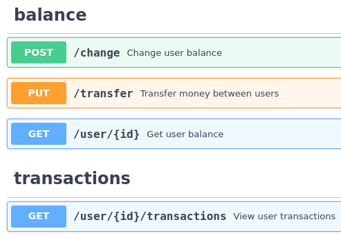

[](https://validator.swagger.io/?url=https://raw.githubusercontent.com/illiafox/balance-api/master/docs/swagger.yaml)

## Requirements

#### - Go: `1.18`
#### - PostgreSQL: `14.2`
#### - Redis: `6.2.6`

---

## docker-compose

API **starts immediately** after containers are up

```shell
docker-compose up # make compose
```


### App port `:8080`

- ### Redis `:6380`
  **Database** `0` **Password** ` `
- ### PostgreSQL `:5430`
  **User** `postgres` **Password** `postgres` **Database** `balance_api`

--- 

## Docs

### 1. Swagger



#### - Run application and open [`0.0.0.0:8080/swagger`](http://0.0.0.0:8080/swagger) page
#### - Visit online [API documentation](https://validator.swagger.io/?url=https://raw.githubusercontent.com/illiafox/balance-api/master/docs/swagger.yaml)

### 2. gRPC
#### Soon...

---

## Logs

```shell
# Terminal (stdout)
27/06 10:49:30 | INFO | app/handler.go:15 | Initializing storages
27/06 10:49:30 | INFO | app/handler.go:34 | Initializing handlers
27/06 10:49:30 | INFO | app/listen.go:44 | Server started {"address": "0.0.0.0:8080", "https": false}
```
```shell
# File (default log.txt)
{"level":"info","ts":"Mon, 27 Jun 2022 10:49:30 UTC","caller":"app/handler.go:15","msg":"Initializing storages"}
{"level":"info","ts":"Mon, 27 Jun 2022 10:49:30 UTC","caller":"app/handler.go:34","msg":"Initializing handlers"}
{"level":"info","ts":"Mon, 27 Jun 2022 10:49:30 UTC","caller":"app/listen.go:44","msg":"Server started","address":"0.0.0.0:8080","https":false}
```

---

## Building and Running

#### 1. Clone repository 
    `git clone https://github.com/illiafox/balance-api`
#### 2. Setup [config](app/cmd/api/config.toml)
#### 3. Build and Run
```shell
make build
make run # ./app
```

### With non-standard config and log file paths:
```shell
app -log=log.txt -config=config.toml
```

### HTTPS
```shell
app -https
```

### Disable swagger
```shell
app -noswag
```

### With reading from environment:
Available keys can be found in the **[config tags](app/internal/config/struct.go)**
```shell
HOST_PORT=80 app
```

## PostgreSQL Migrations
```shell
migrate -database ${POSTGRESQL_URL} -path migrate/ up
```

## Redis
### Example: Store currencies in Hash
```shell
HSET currency EUR 65 
```
Where `currency` is `Redis Hash` Name (`Redis.HashMap` in the [config](app/cmd/api/config.toml) file)

---

## `TODO` (contribution is welcome):

### 1. Add gRPC support (`in progress`)
### 2. Make service for currency rates